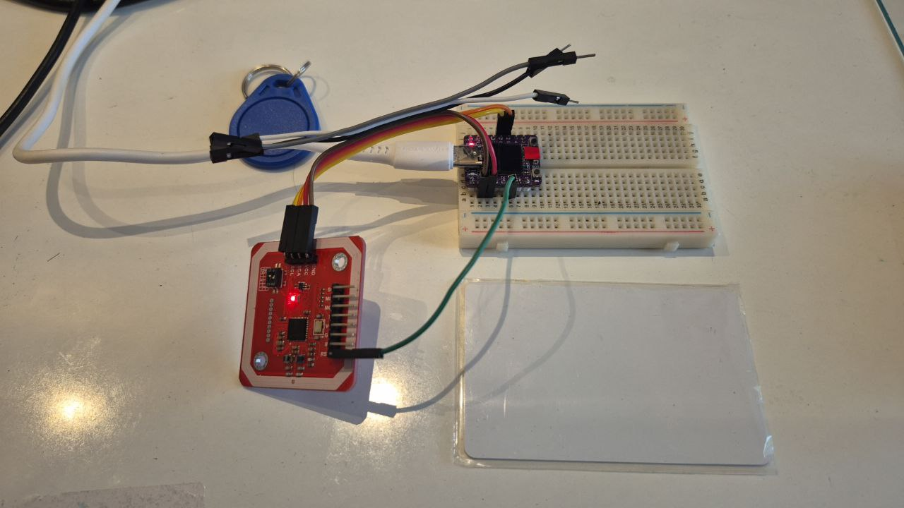

# História boa para contar...

Em 2025-2 dois grupos propuseram usar NFC/RFID em seus projetos. Existem duas placas fáceis de achar no mercado: MFRC522 e PN532 sendo que a segunda é mais difícil de achar e um pouco mais cara mas, até onde sei, consegue estabelecer comunicação por NFC enquanto MFRC522 só consegue ler e escrever cartões. Pedi para usar PN532 e providenciei algumas placas.

Os dois grupos procuraram mas não conseguiram fazer PN532 comunicar-se com ESP32 executando Micropython e interface I2C. Os dois grupos conseguiram com interface SPI. Acontece que SPI usa mais sinais que I2C e ter dois dispositivos I2C em um mesmo microcontrolador seria ilustrativo como exemplo de barramento. Por isso decidi retomar o objetivo: **usar PN532 com Micropython e protocolo I2C**.

## Método

Busquei na internet por referências, o histórico e as anotações que fiz durante a exploração estão anotados em Diário. Usei algumas horas por dia entre 04 e 09 de março.

A solução foi clonar o projeto https://github.com/somervda/nfc-tester , ajustar as configurações à medida que os erros fossem aparecendo e, ao final, ver se o programa executava e dava sinais de conseguir ler o cartão. Importante destacar:

1. os grupos de 2025-2 deixaram documentação de projeto;
2. peguei um dos projetos e reconstruí a parte que me interessava, a probabilidade de sucesso era alta pois os grupos conseguiram usar o PN532 não faz seis meses; 
3. só entendi o que se passava nesse projeto porque li código-fonte de outras origens
4. Quando estudei a biblioteca para SSD1306, que tem versões I2C e SPI, entendi que o protocolo de comunicação era implementado em um decorador aplicado sobre a classe que continha o conhecimento sobre comandos a enviar e estruturas de dados padronizadas (ex. framebuffer).

### Ajustes feitos

Só precisei mudar números de pinos, interface I2C e SSID e PASSWORD do WiFi - todos contidos no arquivo `main.py`. No arquivo havia menção a usar o pino RESET do PN532, conectei-o à GPIO 2.

Renomeei `main.py` para `start.py` porque é mais fácil depurar o código se ele não for executado automaticamente.

## Resultados

Foto do circuito

Captura de tela do programa sendo executado através do Thonny - no REPL, digitar `import start` para executar o programa.

O código-fonte do programa do ESP32 está na pasta `src` deste repositório. Incluí a pasta `lib/` por causa da biblioteca `ssd1306.py`. A biblioteca precisa estar no ESP32 caso contrário ocorrem erros de execução no programa.

## Próximos passos

Resta testar as outras funções, escrever em um cartão, fazer comunicação entre ESPs através do NFC, testar com telefone celular, ... o teste feito apenas lê um cartão.

## Diário

i2c

https://github.com/somervda/nfc-tester/tree/master
https://github.com/somervda/nfc-tester/blob/master/pn532_i2c.py

spi
https://github.com/Carglglz/NFC_PN532_SPI

adafruit

https://github.com/adafruit/Adafruit_CircuitPython_PN532/blob/1453393de440357d89101deb7bd05b525899fdd2/adafruit_pn532/adafruit_pn532.py

https://github.com/adafruit/Adafruit_Blinka/blob/main/src/digitalio.py

assim fica difícil: o buscador enviesa o resultado da busca de maneira que não consigo saber onde está o código-fonte original da classe digitalio. A IA diz que o código-fonte é o do arquivo https://github.com/adafruit/Adafruit_Blinka/blob/main/src/digitalio.py mas esse código depende de outras bibliotecas e estas, pelo nome, me parecem desnecessárias. A decisão que tenho: gastar tempo removendo do arquivo o que acho ser código desnecessário ou buscar todas as dependências e colocar esse código para funcionar??

ocorreu-me que posso tentar desvincular a biblioteca pn532 da biblioteca digitalio, isso pode ser fácil, dependendo do que digitalio fizer. Vi que as constantes e comandos de configuração do pn532 estão na biblioteca pn532 então a chance do código desvinculado funcionar é alta.

resolvi ligar o projeto do Felipe
spi inicializou mas o leitor de cartão não foi encontrado. Causa: mau contato entre modu macho e fêmea em extensão do jumper.
resolvido o mau contato o programa `read.py` leu um cartão.

voltando a https://github.com/adafruit/Adafruit_CircuitPython_PN532/tree/main/adafruit_pn532 , `adafruit_pn532.py` implementa as funções da camada mais alta como `firmware_version(self)` e contém declarações para as funções da camada mais baixa como `_read_data(self, count: int)`. A idéia, que já vi em SSD1306 é que a classe definida em `adafruit_pn532.py` seja uma classe abstrata que recebe decoradores. Esses decoradores implementam as funções da camada mais baixa. Neste caso o decorador deveria ser `i2c.py` (https://github.com/adafruit/Adafruit_CircuitPython_PN532/blob/main/adafruit_pn532/i2c.py) mas eu fiquei no meio do caminho pois a camada de baixo precisa implementar `_wakeup()` e `_wait_ready()` que, na minha cabeça, são funções da camada de cima. 

Presumindo que o breakout board da Adafruit consiga comunicar-se por I2C com o controlador, ainda me resta a dúvida sobre o uso dos sinais RST e IRQ do PN532. Eles são necessários?

Acho que a forma mais fácil é entender `adafruit_pn532.py` e `i2c.py`, limpar as abstrações de digitalio, busses, ... de maneira que com esses dois arquivos eu consiga comunicar com o PN532.

Reli https://github.com/somervda/nfc-tester/tree/master , talvez seja mais fácil instalar o projeto todo dele, ver que erros dá ao executar e ir consertando. A grande vantagem é que é um projeto único. A documentação é quase inexistente mas dá a entender que ele fez o que eu pretendia fazer: reescrever/usar `adafruit_pn532.py` e `i2c.py`. O que ele fez diferente é ajustar o `digitalio.py` ao invés de eliminá-lo. Pelos números dos pinos, acho que ele usa um ESP32S com display OLED, talvez um ttgo t-display (pois tem um reset no pino 16).

<pre><b>fabio@super</b>:<b>~/MeuGithub/nfc-tester</b>$ cat i2cScan.py 
import machine

pin = machine.Pin(16, machine.Pin.OUT)
pin.value(0) #set GPIO16 low to reset OLED
pin.value(1) #while OLED is running, must set GPIO16 in high
</pre>

## README do projeto que clonei: Micropython pn532 rfid/nfc reader/writer code for I2C interface

This uses the adafruit pn532 libraries at https://github.com/adafruit/Adafruit_CircuitPython_PN532
but with updated pn532_i2c.pn to allow it to work with standard micropython
rather than circuit python.

main.py includes sample code for 
1. Initializing and scanning the i2c bus
2. ssd1306 code to use a OLED display to show rfid tag information
3. pn532 code to read uid infomation on rfid and nfc tags

### Reference Documents
- pn532 datasheet https://www.nxp.com/docs/en/nxp/data-sheets/PN532_C1.pdf 
- pn532 user manual https://www.nxp.com/docs/en/user-guide/141520.pdf
- elechouse pn532 devboard manual https://1drv.ms/b/s!AhVEXR9ZKK8pg-kw3DkA_dTuov1nug?e=BMLYho
